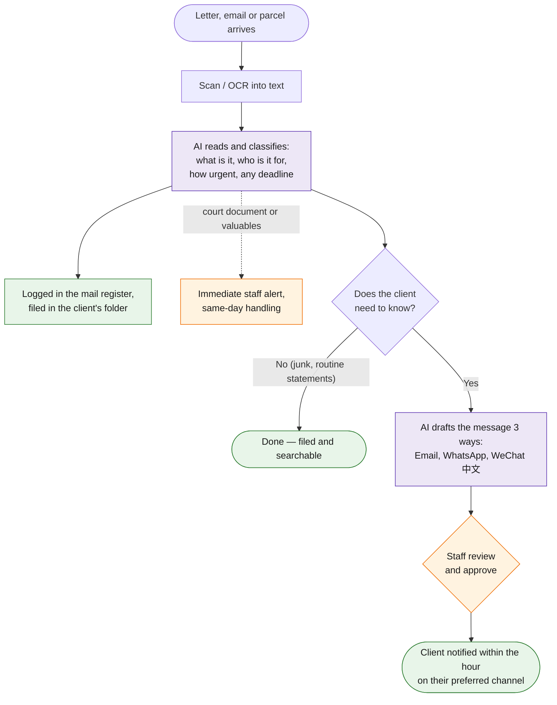

# Task 1 — Incoming Correspondence Handling

> Categorize, log and file all incoming letters, documents, correspondence and parcels. For items requiring client notification, notify the client via email, WeChat and WhatsApp.

**Prototype: yes — in this folder. See [README.md](README.md) for how to run [`run.py`](run.py).**

## Why this design

I've built similar intake triage for customer-support teams: the pattern is identical — a shared inbox where 20% of items are urgent, 30% are noise, and a human currently reads all 100%. The win comes from AI doing the reading and a human only approving the sends.

## Workflow at a glance

*Purple = AI does the work · Orange = a human decides · Green = the result.*

## Workflow

| Step | Actor | Detail |
|---|---|---|
| Trigger | — | New item arrives: email forwarded to intake address, physical mail scanned to a watched folder, parcels logged by front desk on a one-line form |
| 1. OCR / ingest | Automation | Scanned mail passes through OCR (Google Drive OCR or Claude vision on the scan); emails and front-desk parcel logs come in as text |
| 2. Classify | **Claude** | Classifier prompt returns strict JSON: category, addressee, sender, one-line summary, extracted deadline, urgency, notify-or-not decision, suggested action ([prompt](prompts/correspondence_classifier.md)) |
| 3. Log & file | Automation | Row appended to the correspondence log (master tracker Sheet); document filed in the client's folder named `YYYY-MM-DD_category_sender` |
| 4. Draft notifications | **Claude** | For notify-worthy items, one call drafts all three channel versions — email, WhatsApp, WeChat (Traditional Chinese for zh-preference clients) ([prompt](prompts/client_notification.md)) |
| 5. **Human checkpoint** | Staff | Reviews drafts in the pending queue; urgent items are flagged for same-day handling. One click approves and sends |
| 6. Dispatch | Automation | Email via Gmail; WhatsApp via WhatsApp Business API template message; WeChat via WeCom API. Send status written back to the log |

## Tools & why

- **Claude** — best-in-class at reading messy scanned letters and following a strict JSON schema; one model call replaces the entire "read, decide, summarize" loop.
- **Google Sheet + Apps Script** (or n8n) — the log lives where staff already work; no new system to learn.
- **WhatsApp Business API / WeCom** — the two channels HK clients actually read. In the prototype these are mocked as message drafts; production needs approved template messages (noted as a dependency).

## Output

- A complete, searchable correspondence log (who, what, when, deadline, action).
- Filed documents in consistent client folders.
- Client notified on all three channels within the hour, instead of when someone gets to the mail pile.

## Edge cases & escalations

- **Court documents / writs** — forced urgent, never summarized as advice, original flagged for collection, staff alerted immediately.
- **Physical valuables** (chops, share certificates) — notification must confirm secure storage location; item logged with storage reference.
- **Unrecognizable or ambiguous items** — classifier routes to manual review rather than guessing; nothing silently drops.
- **Wrong addressee / non-client mail** — flagged for return-to-sender handling.

## Measurable impact

For a firm receiving ~40 items/day, triage drops from ~2 staff-hours to ~15 minutes of approval time, and urgent legal items can no longer sit unnoticed in a pile until Thursday.
