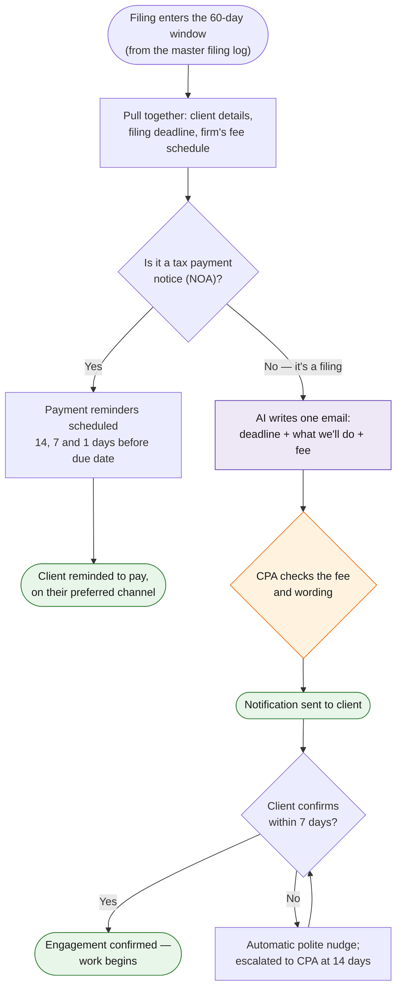

# Task 2 — Statutory Filing Notifications

> For filings such as 56AB, profits tax return and individual tax return, inform the client of the filing deadline, the work the CPA can perform, and the proposed fee — all within the notification email. For notices of assessment, set up a time-based alert to remind the client to pay.

**Prototype: yes — in this folder. See [README.md](README.md) for how to run [`run.py`](run.py).**

## Why this design

This is a revenue workflow disguised as an admin task — every notification is also a quotation. The design treats it that way: the fee comes from a controlled fee schedule (never model-invented), and the email is structured to convert: deadline → consequence → what we'll do → fee → confirm-by date.

## Workflow at a glance

*Purple = AI does the work · Orange = a human decides · Green = the result.*

## Workflow

| Step | Actor | Detail |
|---|---|---|
| Trigger | — | Master filing log (task 3) shows a pending filing entering the 60-day window; or an IRD notice arrives via correspondence triage (task 1) and creates the log entry |
| 1. Assemble context | Automation | Joins three records: client (contact, language, channel), filing (type, deadline), fee schedule (service description, HKD fee) |
| 2. Draft email | **GPT/Claude** | Generates the five-part notification ([prompt](prompts/filing_notification.md)); subject line carries the action, deadline and company name |
| 3. **Human checkpoint** | CPA | Reviews scope wording and fee — fees can be client-specific, so the CPA can override before approval |
| 4. Send & schedule | Automation | Email sent; if no client confirmation within 7 days, a follow-up nudge fires automatically |
| 5. NOA branch | Automation | Notices of assessment skip the quotation flow: a T-14 / T-7 / T-1 payment reminder schedule is created, routed to the client's preferred channel |

## Tools & why

- **GPT or Claude** for drafting — the value is personalization at scale (client name, language register, service framing) without a mail-merge feel.
- **Fee schedule as data, not prompt content** — the model formats the fee, it never chooses it. This is the single most important guardrail in the design.
- **Scheduler** — Apps Script daily trigger in production (`shared/apps_script/reminder_engine.gs`); the prototype writes the alert schedule to CSV.

## Output

- One client-ready email per filing containing deadline, scope and fee (see `sample_output/filing_notifications/` after running the prototype).
- `payment_alerts.csv` — the time-based NOA reminder schedule.

## Edge cases & escalations

- **Overdue filings** still generate a notification flagged OVERDUE, with penalty language — silence is the worst outcome.
- **Client doesn't confirm** — automated nudge at +7 days, escalation to the CPA at +14.
- **Fee = 0 services** (NOA review) render as reminder service, not a HKD 0 quotation.
- **Deadline under 14 days away** — confirm-by compresses to "as soon as possible" and the item is flagged for a phone call.
