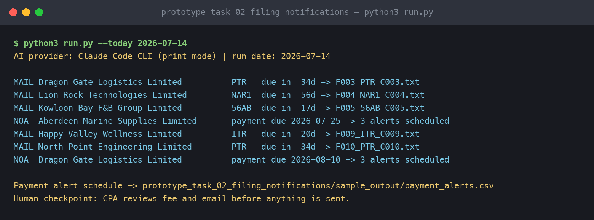
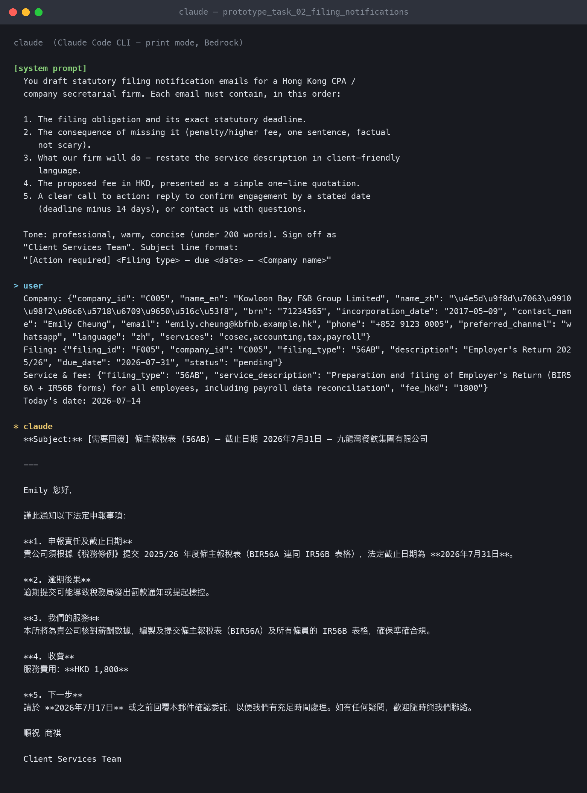
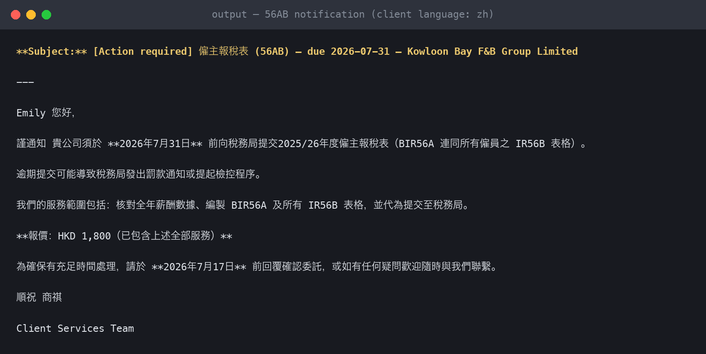

# Prototype 2 — Statutory Filing Notifications + Payment Alerts

**Task covered:** #2 — for 56AB / PTR / ITR filings, notify the client of the deadline, the work the CPA can perform, and the proposed fee — all in one email. For Notices of Assessment, schedule time-based payment reminders.

## What it does

1. Scans `../data/filings.csv` for pending filings due within 60 days.
2. For each, joins the company record and the firm's `fee_schedule.csv`, then generates the full notification email (deadline → consequence → scope of work → fee → call to action) using `prompts/filing_notification.md`.
3. For `payment_due` items (NOAs), builds a **T-14 / T-7 / T-1 alert schedule** in `sample_output/payment_alerts.csv`, routed to each client's preferred channel.

## Run it

```bash
python3 run.py --today 2026-07-14
```

Outputs land in `sample_output/filing_notifications/` — one ready-to-review email per filing.

## Human checkpoint

The CPA reviews the proposed fee and wording before sending; fees come from a controlled fee schedule, never invented by the model.

## Edge cases handled

- Overdue filings are still generated and flagged `OVERDUE` rather than silently skipped.
- Fee of 0 (NOA review service) renders as a reminder service, not a quotation.
- Confirm-by date compresses to "as soon as possible" when under 14 days remain.

## Demo evidence *(links added at submission)*

- Prompt log: [`prompt_log.md`](prompt_log.md) — exported Claude Code conversation running this task's prompts on the sample data
- Screen recording of this prototype running: _link_

## Screenshots

**Terminal run (live via Claude Code CLI):**



**The Claude conversation behind it (from `prompt_log.md`):**



**Generated output:**


