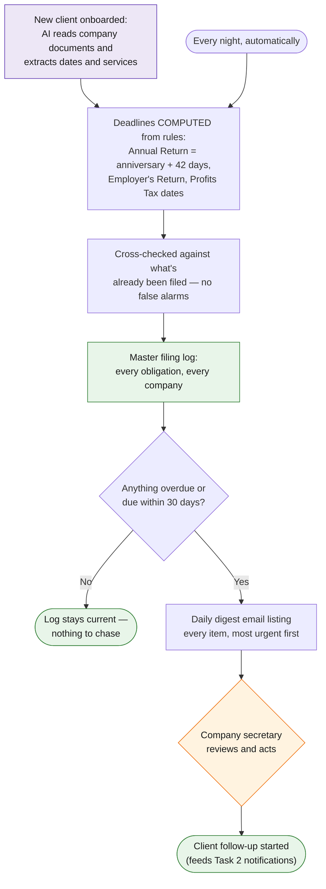

# Task 3 — Master Filing Log

> Log all statutory filing deadlines (56AB, profits tax return, individual tax return, etc.) into a master log so that regular deadline alerts can be sent out for client follow-up.

**Prototype: yes — in this folder. See [README.md](README.md) for how to run [`run.py`](run.py).** (also covers task 8)

## Why this design

In my finance-automation work the biggest failure mode of deadline logs is stale manual entry. So the core design decision here: **deadlines are computed from company records, not typed in.** A company's incorporation date determines its NAR1 deadline forever; the services it buys determine whether 56AB/PTR apply. Humans validate once, then the log maintains itself.

## Workflow at a glance

*Purple = AI does the work · Orange = a human decides · Green = the result.*

## Workflow

| Step | Actor | Detail |
|---|---|---|
| Trigger | — | Nightly scheduled run; also on demand when a company is onboarded |
| 1. Compute obligations | Automation | Per company: NAR1 = anniversary + 42 days (CO s.662); 56AB = 2 May for payroll clients; PTR = block-extension date by year-end code |
| 2. Merge register | Automation | One-off items (NOAs, director ITRs) merged from the filings register; already-filed items cross-referenced out so they never alert |
| 3. Classify status | Automation | `filed` / `tracked` / `due_soon` (≤30 days) / `overdue` |
| 4. AI assist (onboarding) | **Claude** | When onboarding, Claude extracts incorporation dates, year-end codes and service scope from the client's documents to seed the computation — this is where AI removes the data-entry work |
| 5. Alert digest | Automation | Daily email to the company secretary listing everything overdue or inside the window, sorted by date |
| 6. **Human checkpoint** | Secretary | Validates computed deadlines on each company's first appearance; thereafter only exceptions surface |

## Tools & why

- **Google Sheet as the master log** — shared visibility, zero training, filterable by client/type/status; Apps Script trigger sends the digest (`shared/apps_script/reminder_engine.gs`).
- **Claude at onboarding only** — the steady-state loop is deterministic date math, which should never be delegated to a model. AI belongs at the messy edge (reading documents), not in the deadline arithmetic.

## Output

- `master_filing_log.csv` — 24 computed + merged obligations across the 10 demo companies.
- Daily alert digest email; feeds task 2 (client notifications) automatically.

## Edge cases & escalations

- **Overdue items never age out** — they stay in every digest until resolved.
- **Filed items are silenced** by cross-reference, keeping the digest high-signal.
- **Service changes** (client adds payroll) regenerate obligations on next run.
- **Rule changes** (e.g. IRD extension programs) are one constant in one place, not 200 manual row edits.
