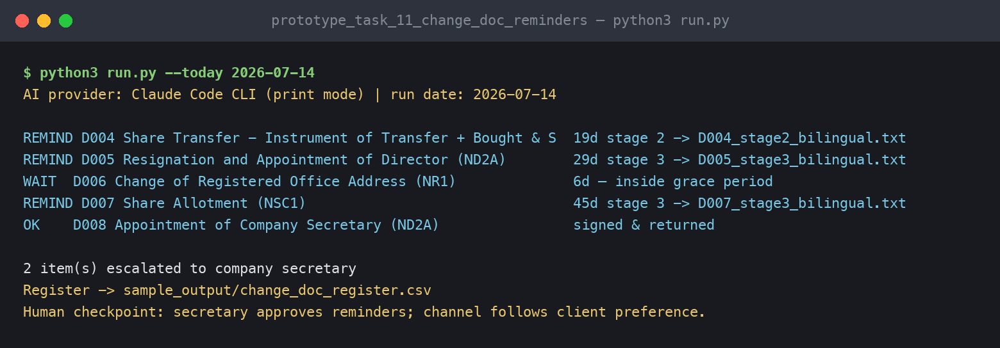
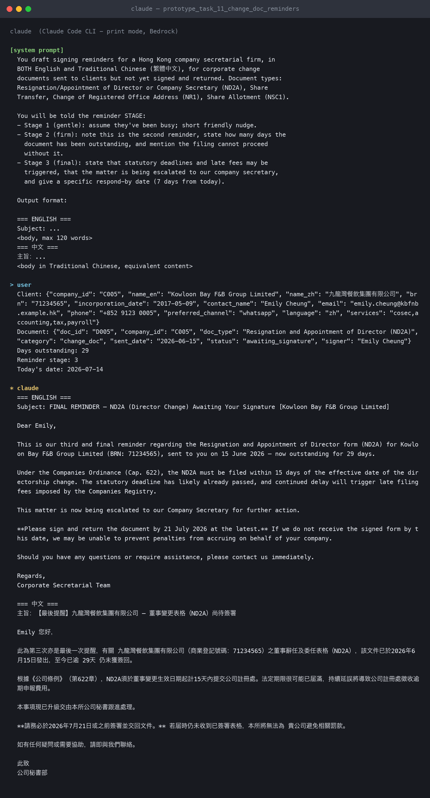
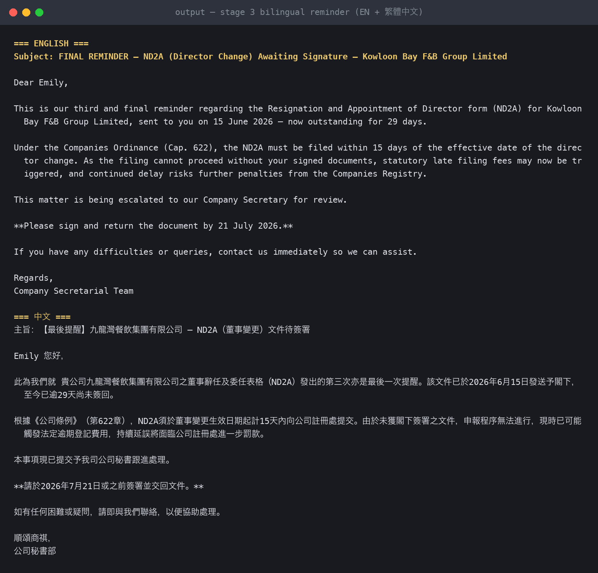

# Prototype 5 — Change-Document Tracking with Bilingual Reminders

**Task covered:** #11 — 已提供給客戶未簽回的變更文件 (change documents provided to clients but not signed back): director/secretary resignation & appointment, share transfers, registered office changes, share allotments.

## What it does

1. Filters the documents-out register to the five change-document types.
2. Maintains a live register (`sample_output/change_doc_register.csv`) with days outstanding, reminder stage, and each client's preferred channel and language.
3. Drafts every reminder in **both English and Traditional Chinese** (`prompts/bilingual_change_doc_reminder.md`) with tone escalating by stage — gentle → firm → final-with-deadline.
4. Stage-3 items generate an internal escalation memo to the company secretary.

## Run it

```bash
python3 run.py --today 2026-07-14
```

Demo shows a stage-2 share transfer (19 days), two stage-3 escalations (29 and 45 days), one inside grace period, and one signed-and-returned.

## Why bilingual matters

Roughly half this firm's clients operate in Chinese (WeChat-preferred contacts in the demo data). A reminder the client actually reads is the difference between a nudge and a phone call — the register carries `language` and `preferred_channel` per client so the right version goes out on the right channel automatically.

## Human checkpoint

Secretary approves reminders before dispatch; stage-3 always lands on a human's desk with the full history.

## Demo evidence *(links added at submission)*

- Prompt log: [`prompt_log.md`](prompt_log.md) — exported Claude Code conversation running this task's prompts on the sample data
- Screen recording of this prototype running: _link_

## Screenshots

**Terminal run (live via Claude Code CLI):**



**The Claude conversation behind it (from `prompt_log.md`):**



**Generated output:**


