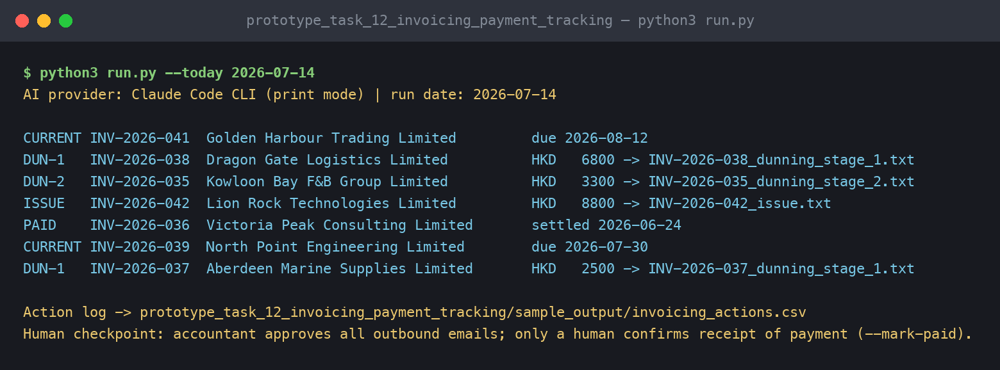
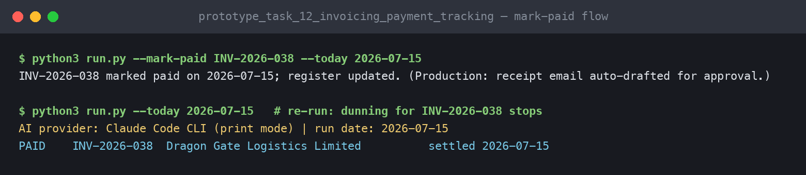
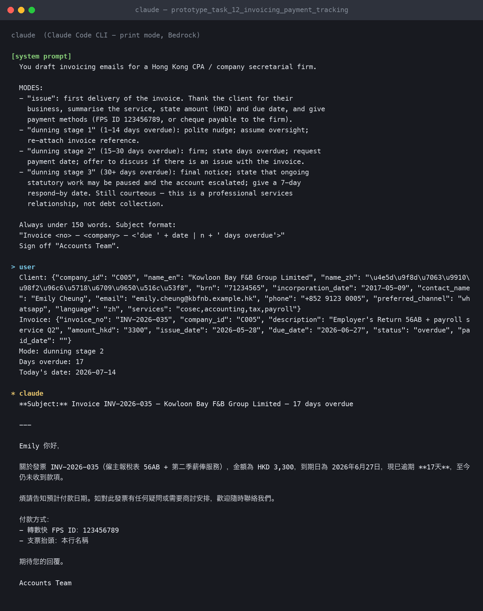
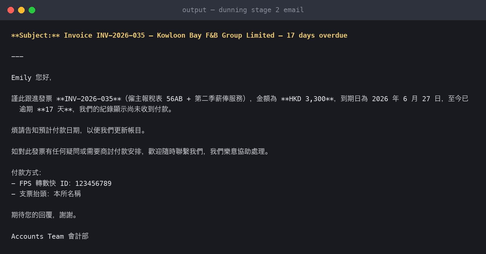

# Prototype 6 — Invoicing & Payment Tracking with AI Dunning

**Task covered:** #12 — email invoices to clients, track payment status, update internal records once payment is received.

## What it does

1. Scans `../data/invoices.csv`:
   - `draft` → generates the issue email (service summary, amount, due date, payment methods).
   - Overdue → picks the dunning stage (1–14 days gentle / 15–30 firm / 30+ final notice) and drafts the stage-appropriate email via `prompts/dunning_sequence.md`.
   - `paid` / current → logged, no action.
2. Writes drafts to `sample_output/invoicing/` and an action log to `sample_output/invoicing_actions.csv`.
3. Payment confirmation updates the register:

```bash
python3 run.py --mark-paid INV-2026-038 --today 2026-07-15
```

## Run it

```bash
python3 run.py --today 2026-07-14
```

Demo shows all five states: issue, dunning stages 1 and 2, paid, and current.

## Human checkpoint

Two deliberate ones: the accountant approves every outbound email, and **only a human marks an invoice paid** — the automation never assumes money arrived. (In production this hook would reconcile against a bank feed and still ask for confirmation.)

## Edge cases handled

- Dunning stays courteous at every stage — this is a professional-services relationship, not debt collection; stage 3 offers to discuss disputes before escalating.
- Draft invoices are never dunned; paid invoices exit the loop with a receipt.

## Demo evidence *(links added at submission)*

- Prompt log: [`prompt_log.md`](prompt_log.md) — exported Claude Code conversation running this task's prompts on the sample data
- Screen recording of this prototype running: _link_

## Screenshots

**Terminal run (issue + dunning stages, live via Claude Code CLI):**



**Payment confirmation flow (`--mark-paid`) — dunning stops:**



**The Claude conversation behind it:**



**Generated stage-2 dunning email:**


