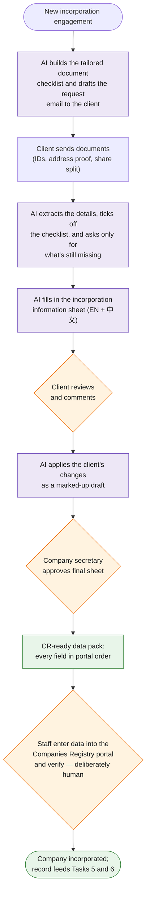
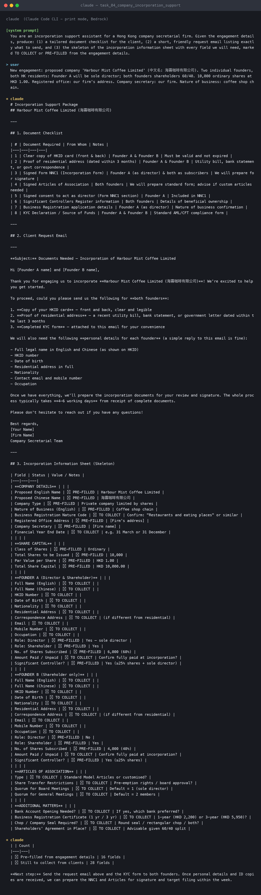

# Task 4 — Company Incorporation Support

> Gather the necessary incorporation documents, prepare the incorporation information sheet, send it to the client for review and comments, update the final sheet, and input the data into the CR (Companies Registry) website.

**Prototype: design only** (document generation is demonstrated in task 6's sample; the CR e-filing step is deliberately human)

## Workflow at a glance

*Purple = AI does the work · Orange = a human decides · Green = the result.*

## Workflow

| Step | Actor | Detail |
|---|---|---|
| Trigger | — | New incorporation engagement confirmed |
| 1. Requirements checklist | **Claude** | Generates the tailored document checklist from engagement details (shareholders count, corporate vs individual directors, share structure) and drafts the client request email listing exactly what to send: ID/passport copies, address proof, proposed names, share split |
| 2. Intake & extraction | **Claude** | As client documents arrive (via task-1 triage), Claude extracts structured fields — names as per ID, addresses, ID numbers, shareholding — into a JSON record; checklist items tick off automatically, and gaps trigger a follow-up email listing only what's still missing |
| 3. Information sheet | **Claude** | Populates the firm's incorporation information sheet template from the JSON record — company name (EN/中文), registered office, share capital, directors, secretary, members |
| 4. **Human checkpoint 1** | Client | Sheet sent for review; client comments come back by email, Claude proposes the edits as a redline for staff to accept |
| 5. Finalize | Automation | Final sheet versioned and archived; JSON record updated to match |
| 6. CR input | **Human, AI-assisted** | Staff enters data into the CR e-Registry portal. Deliberately not automated: it's a government submission behind login with legal consequences for error. Instead, the automation produces a **CR-ready data pack** — every field in portal order — turning a re-keying-from-documents task into a copy-paste-and-verify task |
| 7. **Human checkpoint 2** | Company secretary | Final review before submission |

## Tools & why

- **Claude** — document extraction (IDs, address proofs) and bilingual sheet drafting are exactly its strengths; extraction confidence below threshold routes to a human instead of guessing.
- **Google Docs template + Sheet record** — the information sheet stays in the format clients already know.
- **No CR automation** — a conscious scope decision, documented to the evaluator: browser automation against a government portal is brittle and risky; the 80% win is eliminating re-keying, which the data pack achieves safely.

## Output

Complete incorporation information sheet (client-approved), structured company record that seeds tasks 3/5/6, and a CR-ready data pack.

## Edge cases & escalations

- **Missing/expired ID documents** — checklist gap email is specific ("passport copy for director 2"), not generic.
- **Name availability** — proposed names checked against the CR index early; clashes surface before the client falls in love with a name.
- **Corporate shareholders** — checklist branches to require the corporate entity's own CI/BR and authorized signatory evidence.
- **Extraction uncertainty** (blurry scans, transliterated names) — flagged for human keying rather than silently guessed.

## Demo evidence

- Prompt log: [`prompt_log.md`](prompt_log.md) — the actual Claude conversation running this design's prompts on sample data (captured via Claude Code CLI, Bedrock-hosted)

### Screenshot — the Claude conversation

