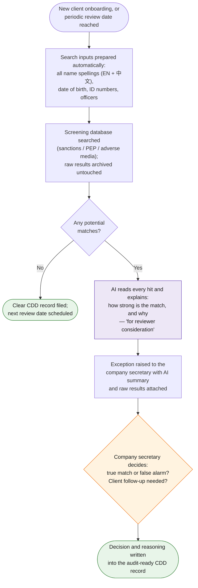

# Task 5 — CDD (Client Due Diligence) Search

> Input client details into the CDD search database, document the search results, and escalate any exceptions to the company secretary for client follow-up.

**Prototype: design only** (compliance-sensitive; the design keeps AI in the summarization seat, never the decision seat)

## Why this design

CDD is the one task on this list where "the AI decided" is not an acceptable audit answer. So the division of labour is strict: the **search** is deterministic (API call to the screening database), the **summarization and drafting** is AI, and the **risk decision** is always human. AI removes the reading and paperwork, not the judgment.

## Workflow at a glance

*Purple = AI does the work · Orange = a human decides · Green = the result. Note the search itself is deliberately **not** AI — completeness is a regulatory requirement.*

## Workflow

| Step | Actor | Detail |
|---|---|---|
| Trigger | — | New client onboarding (from task 4's structured record) or periodic review date reached |
| 1. Prepare search inputs | Automation | Names (EN + 中文 + transliterations), DOB, ID numbers, and corporate officers pulled from the structured client record — no re-keying |
| 2. Run screening | Automation | Query against the screening provider (World-Check / Dow Jones in production; OpenSanctions API works for a functioning demo). Raw results archived unmodified for the audit trail |
| 3. Summarize hits | **Claude** | For each potential match, Claude writes a structured assessment: match strength (name/DOB/nationality alignment), list type (sanctions/PEP/adverse media), and a plain-English rationale — explicitly labelled "for reviewer consideration" |
| 4. Document | Automation | CDD search record generated: who was searched, when, against what lists, results, reviewer, decision — the file an auditor wants to see |
| 5. Exception routing | Automation | Any non-clear result opens an exception: escalation email to the company secretary with the AI assessment and raw hits attached |
| 6. **Human checkpoint** | Company secretary | Reviews every exception; makes the true/false-match determination; decides client follow-up (source-of-funds questions, enhanced due diligence) |
| 7. Close the loop | Automation | Decision and rationale written back to the CDD record; periodic re-screening date set (annual, or quarterly for higher-risk ratings) |

## Tools & why

- **Screening API, not AI, for the search** — completeness and reproducibility are regulatory requirements; a model must never be the thing that "didn't find" a sanctions hit.
- **Claude for hit summarization** — screening results are notoriously noisy (common names produce dozens of false candidates); AI triage of *reading* the hits is where hours go today.
- **Immutable audit log** — raw provider responses stored alongside AI summaries and the human decision.

## Output

Complete CDD search record per client, exception escalations with reasoned AI pre-assessment, and a re-screening schedule feeding the master log (task 3).

## Edge cases & escalations

- **Common-name false positives** — AI marks weak matches with explicit reasoning ("DOB mismatch, different nationality") but a human still confirms clears above a match-score threshold.
- **Chinese-name transliterations** — search runs all name variants from the client record, the classic gap in manual CDD.
- **Provider outage** — onboarding blocks rather than proceeds; CDD is a gate, not a beautifier.
- **True hits** — immediate escalation, client-facing work pauses, and the record locks pending the secretary's determination.
