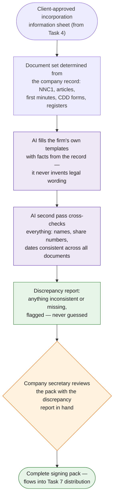

# Task 6 — Incorporation Document Preparation

> Prepare the necessary incorporation documents, minutes, CDD forms and registers.

**Prototype: design only** — but the mechanism is proven by prototypes 2/4/5, which generate documents from structured records the same way; a sample first-minutes generation prompt is included below.

## Workflow at a glance



*Purple = AI does the work · Orange = a human decides · Green = the result.*

## Workflow

| Step | Actor | Detail |
|---|---|---|
| Trigger | — | Client-approved incorporation information sheet (task 4 output) |
| 1. Determine document set | Automation | From the structured record: NNC1, Articles of Association (model articles + tailored share capital), first board minutes, CDD forms per beneficial owner, registers (members, directors, secretaries, significant controllers) |
| 2. Generate | **Claude** | Each document generated by filling the firm's own precedent templates from the JSON record. Key rule: **templates are the source of legal wording; the record is the source of facts; Claude only joins the two.** It never invents clauses |
| 3. Self-check pass | **Claude** | Second pass cross-checks every generated document against the record: names spelled identically everywhere, share numbers consistent between NNC1, minutes and register, dates aligned. Output is a discrepancy list, which is exactly what a senior reviewer does today |
| 4. **Human checkpoint** | Company secretary | Reviews the pack with the AI discrepancy report in hand — review time drops because the mechanical cross-checking is already done |
| 5. Assemble & dispatch | Automation | Pack assembled with signature tabs and an execution checklist; feeds directly into distribution & tracking (task 7) |

## Sample generation prompt (first board minutes)

```
You prepare corporate documents for a Hong Kong company secretarial firm.
Fill the attached FIRST BOARD MINUTES template using only facts from the
company record JSON below. Rules:
- Use template wording exactly; replace only {{placeholders}}.
- Names must match the record character-for-character (including 中文 names).
- If a required fact is missing from the record, output
  "MISSING: <field>" instead of guessing.
Company record: <JSON>
Template: <template text>
```

## Tools & why

- **Claude** — long-context template filling plus the consistency-check pass; the discrepancy report turns AI from a drafting tool into a quality tool.
- **Firm's own precedents** — legal wording stays under the firm's control and versioning; the AI never freelances boilerplate.

## Output

Complete, internally consistent incorporation pack: NNC1 data, articles, first minutes, CDD forms, all statutory registers — with an AI-generated discrepancy report attached for the reviewer.

## Edge cases & escalations

- **Missing facts** — generation refuses with `MISSING: <field>` rather than inventing (the single most important behaviour in document automation).
- **Non-standard share structures** — flagged for manual drafting; the automation covers the standard 90%, not the exotic 10%.
- **Bilingual names** — record holds both EN and 中文; the check pass verifies both forms wherever they appear.

## Demo evidence

- Prompt log: [`prompt_log.md`](prompt_log.md) — the actual Claude conversation running this design's prompts on sample data (captured via Claude Code CLI, Bedrock-hosted)
