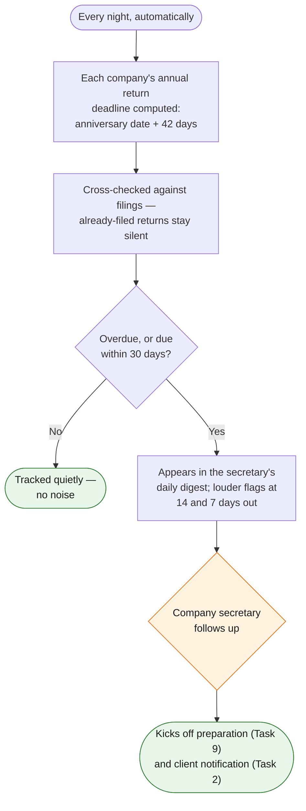

# Task 8 — Annual Return Deadline Tracking

> Track statutory filing deadlines for annual returns and notify the company secretary for follow-up.

**Prototype: yes — covered by [`prototype_task_03_master_filing_log/`](../prototype_task_03_master_filing_log/)**, which computes annual-return deadlines alongside all other filings.

## Why this is a computed problem, not a tracked one

An annual return deadline is pure arithmetic: the NAR1 must be delivered within 42 days of the company's return date (its incorporation anniversary) under s.662 of the Companies Ordinance. Every company's deadline for every future year is knowable the day it's onboarded — so the design *computes* deadlines from the incorporation date rather than asking anyone to remember or type them.

## Workflow at a glance

*Orange = a human decides · Green = the result. Deliberately no purple in the loop: deadline arithmetic is code, not AI — AI works upstream (reading documents at onboarding) and downstream (writing notifications).*

## Workflow

| Step | Actor | Detail |
|---|---|---|
| Trigger | — | Nightly run of the master filing log engine (task 3) |
| 1. Compute | Automation | Per company: this year's anniversary + 42 days; cross-referenced against the filings register so filed returns don't alert |
| 2. Window alerts | Automation | Entering the 30-day window → appears in the secretary's daily digest; T-14 and T-7 get louder flags; overdue items lead the digest until resolved |
| 3. **Human checkpoint** | Company secretary | Acts on the digest — typically kicking off task 9 (preparation) and task 2 (client notification with fee) |
| 4. Downstream | Automation | The same log entry drives the client notification, the preparation trigger, and eventually the signing chase (task 10) — one source of truth end to end |

## Tools & why

- **Deterministic date math, zero AI in the loop** — worth stating explicitly: a statutory deadline calculation is the *last* place to put a language model. AI's role in this pipeline is upstream (extracting incorporation dates from documents at onboarding) and downstream (writing the notifications). The arithmetic in between is code.
- **Apps Script daily trigger** on the master Sheet (`shared/apps_script/reminder_engine.gs`).

## Output

Annual-return rows in the master filing log with live day counts, and a daily digest where nothing statutory can fall through the cracks — see the demo run output: 24 obligations tracked, overdue and due-soon items surfaced, filed ones silenced.

## Edge cases & escalations

- **Late-registered incorporation-date corrections** propagate automatically on the next run.
- **Overdue never ages out** — the digest repeats it daily, with the escalating CR late fee bands (HKD 870–3,480) worth citing in the client notification.
- **Company being dissolved/dormant** — status field excludes it from computation rather than deleting history.
