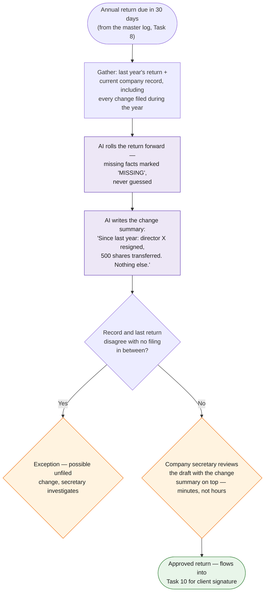

# Task 9 — Annual Return Preparation

> Roll forward annual returns and send to the company secretary for review.

**Prototype: design only** — the roll-forward prompt below is ready to run; the mechanics (structured record → filled template → human review) are demonstrated live in prototypes 2/4/5.

## Why this design

An annual return is 95% last year's return. The valuable human question is not "fill in these forms" but "what changed?" — so the design centres on an AI-generated **change summary**, and the roll-forward itself is template-filling from the company record.

## Workflow at a glance



*Purple = AI does the work · Orange = a human decides · Green = the result.*

## Workflow

| Step | Actor | Detail |
|---|---|---|
| Trigger | — | Master log (task 8) shows an annual return entering the preparation window (T-30) |
| 1. Gather state | Automation | Pulls last year's NAR1 data and the company's current record — including any changes filed during the year (director changes, share transfers, address changes from task 11's register) |
| 2. Roll forward | **Claude** | Fills the NAR1 dataset for the new return date from the current record; refuses with `MISSING: <field>` rather than guessing |
| 3. Change summary | **Claude** | Diffs current vs last year and writes a one-paragraph summary: "Since the 2025 return: Mr. X resigned as director (ND2A filed 2026-03-02); 500 shares transferred from A to B. No other changes." |
| 4. **Human checkpoint** | Company secretary | Reviews the draft *with the change summary on top* — confirming three known changes is minutes; re-deriving them from files is the hour this task currently costs |
| 5. Dispatch | Automation | Approved return flows into distribution & tracking (task 10) for client signature |

## Roll-forward prompt

```
You prepare Hong Kong Annual Return (NAR1) data for a company secretarial
firm. Using the company record JSON (current state) and last year's NAR1
data JSON, produce:
1. NAR1_DATA: the complete field set for a return made up to {{return_date}},
   using current-state facts. Never carry forward a fact that the current
   record contradicts. If a required field is missing, output
   "MISSING: <field>".
2. CHANGE_SUMMARY: plain-English paragraph listing every difference from
   last year's return, citing the filing that effected each change where
   available. If nothing changed, say exactly that.
Current record: <JSON>   Last year NAR1: <JSON>
```

## Tools & why

- **Claude** — the diff-and-explain step is the AI-native part; the form data itself comes from the record, keeping facts out of the model's hands.
- **The task-11 change register as input** — changes were already captured when they happened, so the roll-forward inherits them instead of rediscovering them.

## Output

Draft NAR1 dataset + change summary, reviewer-ready; approved output feeds task 10 automatically.

## Edge cases & escalations

- **Unfiled changes discovered** (record says X, last return says Y, no filing in between) — flagged as an exception; this is how the automation *catches* compliance gaps instead of papering over them.
- **Dormant companies** — summary states "no changes"; reviewer approval becomes a ten-second confirmation.
- **Missing data** — explicit `MISSING` markers, never silent carry-forward of stale facts.

## Demo evidence

- Prompt log: [`prompt_log.md`](prompt_log.md) — the actual Claude conversation running this design's prompts on sample data (captured via Claude Code CLI, Bedrock-hosted)
