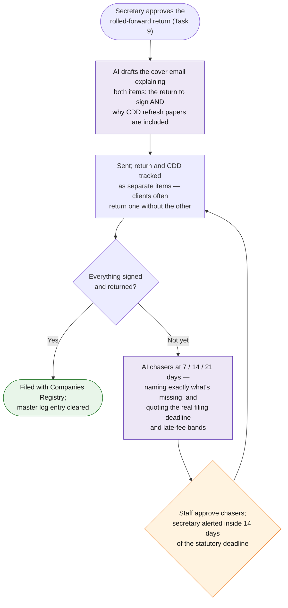

# Task 10 — Annual Return Distribution & Tracking

> Send out updated annual returns and necessary CDD documents for client signature; chase signing status and remind the company secretary if not yet returned.

**Prototype: yes — covered by [`prototype_task_07_doc_distribution_tracking/`](../prototype_task_07_doc_distribution_tracking/)** (shared engine with task 7; annual-return packs are demo rows D002/D003/D009)

## Workflow at a glance

*Purple = AI does the work · Orange = a human decides · Green = the result.*

## Workflow

| Step | Actor | Detail |
|---|---|---|
| Trigger | — | Secretary approves the rolled-forward return (task 9 output); annual CDD refresh forms bundled in per the firm's periodic-review policy |
| 1. Dispatch | Automation + **Claude** | Cover email explains both items — why the return needs signing *and* why CDD papers are included ("annual regulatory refresh, 5 minutes") — reducing the classic "why are you asking for my passport again" back-and-forth |
| 2. Track | Automation | Register row per document (return and CDD tracked separately, since clients often return one without the other) |
| 3. Chase | **Claude** | Standard 7/14/21-day escalation; because this pack has a statutory deadline behind it, stage 2+ chasers state the actual NAR1 filing date and the CR late-fee bands |
| 4. **Human checkpoint** | Staff approve chasers; secretary receives stage-3 escalation with the filing deadline highlighted |
| 5. Close | Automation | Signed return marked received → filing proceeds → master log (task 8) entry moves to `filed`, which silences its alerts. The loop is closed end to end |

## Tools & why

Same shared reminder engine as tasks 7 and 11 (`shared/engine.py`, production: `shared/apps_script/reminder_engine.gs`). One engine, three registers, one place to tune thresholds — and the deadline-awareness here is just one extra field the chaser prompt receives.

## Output

Dispatched return + CDD packs with per-document tracking, deadline-aware chasers, and automatic hand-back to the master filing log when signed.

## Edge cases & escalations

- **Return signed but CDD missing** (or vice versa) — per-document rows mean the chaser names exactly what's outstanding.
- **Deadline approaching with no signature** — escalation severity is driven by the *filing* deadline, not just days-since-sent; inside T-14 the secretary is alerted regardless of chase stage.
- **Client claims documents never arrived** — dispatch log holds send timestamp and channel; re-send is one click with history preserved.
